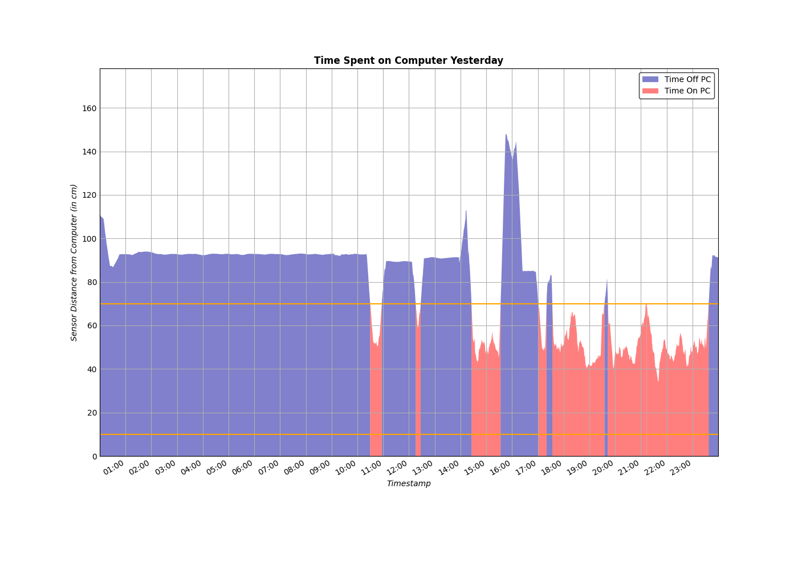
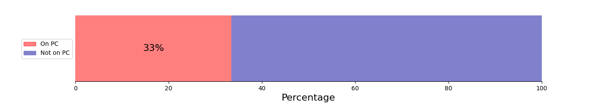

# Hello there ( ´◔ ω◔`) ノシ

I'm a Data Scientist and I love learning about Statistics.

## So here's some data about me (☞ﾟヮﾟ)☞

### Distance from the sensor hooked to my desk throughout the day
<figure>
  <picture>
    <source media="(prefers-color-scheme: dark)" srcset="Pi/readme/graphs/lineplot/dark-plot-2024-08-03.png">
    <source media="(prefers-color-scheme: light)" srcset="Pi/readme/graphs/lineplot/light-plot-2024-08-03.png">
    
  </picture>
  <figcaption>Fig 1. Sensor Data from 2024-08-03</figcaption>
</figure>

### Aggregate Time Spent on the PC
<figure>
  <picture>
    <source media="(prefers-color-scheme: dark)" srcset="Pi/readme/graphs/barplot/dark-plot-2024-08-03.png">
    <source media="(prefers-color-scheme: light)" srcset="Pi/readme/graphs/barplot/light-plot-2024-08-03.png">
    
  </picture>
  <figcaption>Fig 2. Percentage of Time Spent on the PC on 2024-08-03</figcaption>
</figure>
